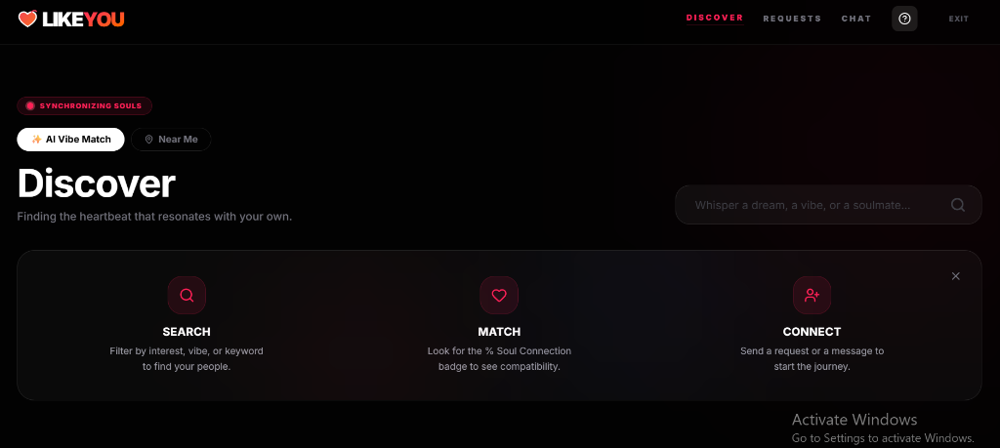
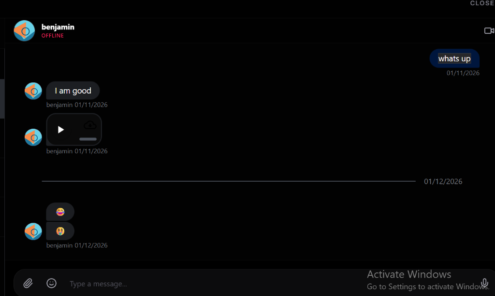
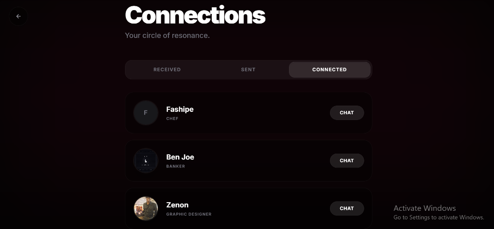
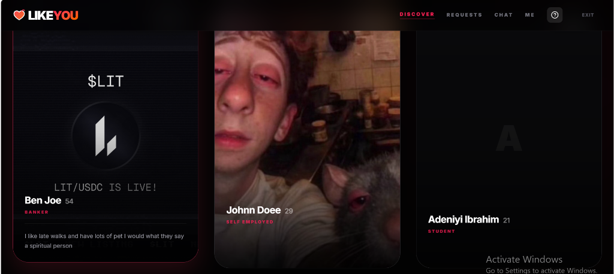

# LikeYou V3

**A premium AI-powered social connector built for meaningful connections.**

> [!NOTE]
> This is a public showcase repository. The source code, AI models, and backend logic are private.

## Live Demonstration

**[Visit the live application](https://likeyou-lac.vercel.app/)**

---

## Interface Overview

| Landing Page | Chat Interface |
|:---:|:---:|
|  |  |

| AI Matching | Profile View |
|:---:|:---:|
|  |  |

---

## Key Features

LikeYou V3 moves beyond conventional matchmaking by utilizing advanced AI to identify semantic matches based on deep compatibility.

-   **Semantic AI Matching**: Matches are curated based on vector embeddings of user interests, values, and bios using Google Gemini AI.
-   **Real-Time Messaging**: Robust, low-latency chat infrastructure powered by Stream Chat.
-   **Premium UI**: A high-fidelity, immersive aesthetic designed with Tailwind CSS, Framer Motion, and Shadcn/UI.
-   **Comprehensive Profiles**: Detailed profile system featuring avatar uploads and psychological profiling.

## System Architecture

For a technical overview of the AI matching logic, please refer to the [System Overview](./HOW_IT_WORKS.md).

## Technology Stack

This project is built on a modern, high-performance stack:

-   **Frontend**: Next.js 14, TypeScript, Tailwind CSS
-   **Backend**: Supabase (PostgreSQL + Auth)
-   **AI**: Google Gemini Pro (Embeddings & Generation)
-   **Vector Search**: pgvector
-   **Real-time**: Stream Chat

---

*Created by [Your Name]*
